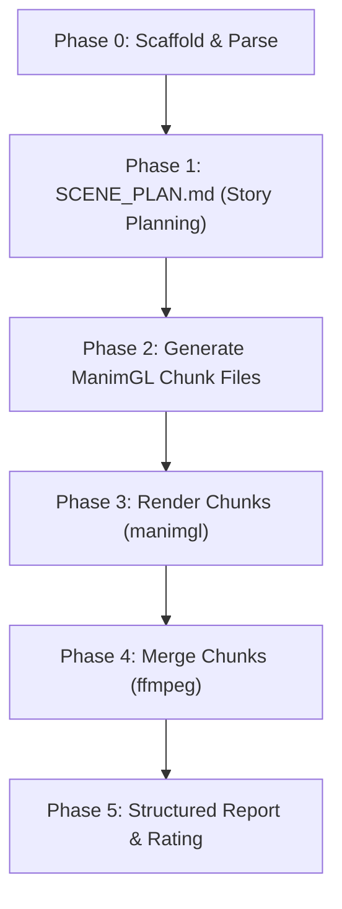

# 🎬 test-manim

[](LICENSE)
[](#claude-code-plugin)
[](#opencode)
[](https://github.com/3b1b/manim)

An AI-powered agent skill that turns any Large Language Model into a high-fidelity **STEM animation teacher**. Give it a topic, and it generates, renders, and merges stunning, pedagogically-rich educational videos using **ManimGL**.

This skill is designed for developer agents, terminal assistants, and IDE rules across all major platforms, enforcing a rigorous, structured pipeline for creating visual explanations.

---

## 🗺️ Table of Contents

- [✨ Core Philosophy](#-core-philosophy)
- [📦 Installation & Integration](#-installation--integration)
  - [Claude Code](#1-claude-code-plugin)
  - [opencode](#2-opencode-skill)
  - [IDE Instructions (Cursor, Windsurf, Cline, Copilot)](#3-ide-integration-rules)
  - [Manual Integration (Any LLM/Agent)](#4-manual-integration)
- [🏗️ The 5-Phase Pipeline](#️-the-5-phase-pipeline)
- [🎨 Pedagogical & Storytelling Principles](#-pedagogical--storytelling-principles)
  - [The 3-Act Structure](#the-3-act-structure)
  - [Color Semantics](#color-semantics)
  - [Pacing Guidelines](#pacing-guidelines)
  - [Common Anti-Patterns](#common-anti-patterns)
- [💻 Usage & Options](#-usage--options)
- [🛠️ Developer & Contribution Guide](#️-developer--contribution-guide)

---

## ✨ Core Philosophy

Standard LLMs often struggle with creating animations because they dump long equations, use random colors, build overly complex layouts, or write broken syntax. 

**`test-manim`** solves this by equipping AI agents with a strict set of rules, templates, and references:
- **Narrative-first**: Outlines a deep pedagogical strategy *before* writing any code.
- **15-second chunking**: Divides long videos into digestible, single-concept pieces.
- **ManimGL native compatibility**: Enforces exact API usage (`ShowCreation`, `TexText`, `Tex`) instead of mixed ManimCE elements.
- **Audio-ready layouts**: Intentionally embeds pacing margins and holds to allow seamless voice-over integration later.

---

## 📦 Installation & Integration

### 1. Claude Code (Plugin)
Install the plugin directly within your [Claude Code](https://github.com/anthropics/claude-code) environment:
```bash
claude plugin install shihabshahrier/manim-coding-skill
```
*Once installed, you can invoke the generator in any chat session using the `/test-manim` command.*

### 2. opencode (Skill)
For users running [opencode](https://github.com/opencode-co/opencode) or similar tools:
```bash
npx skills add shihabshahrier/manim-coding-skill
```
*This instantly enables the `/test-manim` command inside your active session using any model.*

### 3. IDE Integration (Rules)
This repository includes pre-configured, condensed rules tailored to popular AI coding editors. They automatically sync with the source skill:

| Editor | File Location | Activation |
|--------|---------------|------------|
| **Cursor** | `.cursor/rules/test-manim.mdc` | Triggered by `.mdc` context rules |
| **Windsurf** | `.windsurf/rules/test-manim.md` | Handled by Windsurf global rules |
| **Cline** | `.clinerules/test-manim.md` | Enabled for all Cline projects |
| **Copilot** | `.github/copilot-instructions.md` | Read during GitHub Copilot conversations |

### 4. Manual Integration
You can paste the core instruction file into *any* custom LLM system prompt or custom agent instructions:
👉 **[skills/test-manim/SKILL.md](file:///Users/shahriar/Desktop/github/manim-coding-skill/skills/test-manim/SKILL.md)**

---

## 🏗️ The 5-Phase Pipeline

To guarantee visual consistency, syntax correctness, and rendering reliability, the skill enforces a rigid execution pipeline:



1. **Phase 0 — Parse & Scaffold**: Parses args, determines segment count, and sets up a deterministic project directory.
2. **Phase 1 — Narrative Planning**: Generates a comprehensive script and storyboard (`SCENE_PLAN.md`) outlining the educational hook, build order, and synthesis act.
3. **Phase 2 — Scene Generation**: Writes isolated, self-contained Python scene files matching the visual plans using native ManimGL APIs.
4. **Phase 3 — Render**: Automatically runs a generated parallel or ordered shell script (`render.sh`) to render chunks in HD.
5. **Phase 4 — Merge**: Seamlessly strings all chunks together via FFmpeg (`merge.sh`) to produce a single fluid video.
6. **Phase 5 — Report**: Compiles a detailed feedback summary including timing logs, design checks, and quality ratings.

---

## 🎨 Pedagogical & Storytelling Principles

### The 3-Act Structure
Every animation must avoid the "academic lecture" trap and instead follow a structured story:
1. **Act 1: The Question (Hook)**: Open with a striking physical phenomenon or paradox before writing any text or math. Instigate curiosity.
2. **Act 2: The Build (Chunks)**: Step-by-step introduction of concepts. One chunk = one single concept. Move from physical intuition towards formal abstractions.
3. **Act 3: The Synthesis (Resolution)**: Loop back to the Act 1 visual, now annotated with the newly taught context. Hold the final insight frame static for 3–5 seconds.

### Color Semantics
Colors are used to convey mathematical and physical meaning, not as decoration. A strict "color contract" is defined in Phase 1 and adhered to across all chunks:
* 🟦 **BLUE**: Primary concept / object of focus (e.g., mass, current, graph).
* 🟨 **YELLOW**: Secondary concept / dynamic vectors (e.g., force, electric field, derivatives).
* 🟥/🟩 **RED / GREEN**: Highlight, accentuation, or contrast (e.g., acceleration, positive/negative states).
* ⬜ **WHITE**: Titles, axes, standard text, and LaTeX equations.

### Pacing Guidelines

| Interaction / Element | Visual Timing | Action |
|-----------------------|---------------|--------|
| **New Object Arrival** | `1.5s - 2.0s` | Slow entry to let the eye adjust |
| **Object in Motion** | `0.5s - 1.0s` | Snappy, indicating immediate relationship |
| **LaTeX Equation Arrives** | `1.5s - 2.5s` | Slow drawing, letting symbols sink in |
| **Key Insight Pause** | `3.0s` minimum | Hold frames to allow mental processing |
| **Scene Transition** | `0.5s` | Clean, quick fade-outs |

### Common Anti-Patterns
* ❌ **Definition Dumps**: Showing equations or text titles before showing the physical object or graph.
* ❌ **Color Chaos**: Changing the role of colors between scenes (e.g. Blue represents velocity in chunk 1, but stands for gravity in chunk 2).
* ❌ **Too Many Elements**: Animating 4 unrelated things at once. We show, explain, then build.
* ❌ **Wall of Text**: Writing paragraphs on screen. Main text is capped at **8 words max** per element.

---

## 💻 Usage & Options

Run the skill command within your terminal or chat session:
```bash
/test-manim "topic" [--duration 30|60|90|120] [--model name]
```

### Arguments

| Parameter | Default | Values / Description |
|-----------|---------|----------------------|
| **`topic`** | *Required* | Any STEM (Science, Tech, Engineering, Math) subject string. |
| **`--duration`** | `30` | `30`, `60`, `90`, `120` (in seconds). Total length of final video. |
| **`--model`** | *Derived* | Model identifier used in folder names (e.g. `claude`, `gpt4`). |

### Example Output Structure
For `/test-manim "Fourier Series" --duration 30`:
```
manim-claude/
  fourier_series/
    scenes/
      chunk_01_approx.py    # Chunk 1: The Hook
      chunk_02_harmonics.py # Chunk 2: The Build
    output/
      chunks/               # Isolated chunk .mp4 renders
      final/
        fourier_series_final.mp4  # Merged high-quality video
    assets/
    SCENE_PLAN.md           # The storyboard and script
    render.sh               # Executable to render all chunks
    merge.sh                # Executable to join chunks using ffmpeg
```

### System Requirements
* **Python 3.8+**
* **ManimGL** v1.7.2+ (`pip install manimgl`)
* **FFmpeg** (accessible in PATH for merging video outputs)
* **LaTeX installation** (e.g. TeX Live, MiKTeX for formula rendering)

---

## 🛠️ Developer & Contribution Guide

To suggest changes to the prompt strategies, API definitions, or storytelling templates, please review [CONTRIBUTING.md](CONTRIBUTING.md):

1. **Main Prompt / Instruction File**: Edit [skills/test-manim/SKILL.md](file:///Users/shahriar/Desktop/github/manim-coding-skill/skills/test-manim/SKILL.md)
2. **ManimGL API Cheat-Sheet**: Edit [skills/test-manim/references/manim-gl-api.md](file:///Users/shahriar/Desktop/github/manim-coding-skill/skills/test-manim/references/manim-gl-api.md)
3. **Pacing & Narrative Guides**: Edit [skills/test-manim/references/storytelling.md](file:///Users/shahriar/Desktop/github/manim-coding-skill/skills/test-manim/references/storytelling.md)

> [!WARNING]
> Do not edit the editor-specific copies (`.cursor/`, `.windsurf/`, `.clinerules/`) directly. They are auto-generated and synchronized from the main source of truth files.

*Let's build stunning educational visualizations together!* 🚀

---

📖 **Project page:** https://shihub.online/projects/manim-coding-skill
